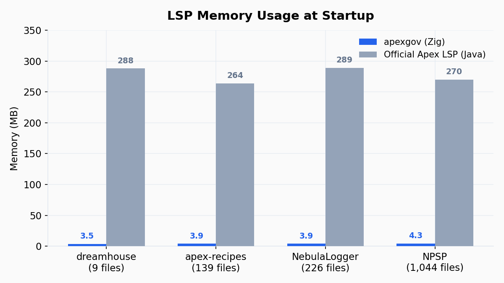
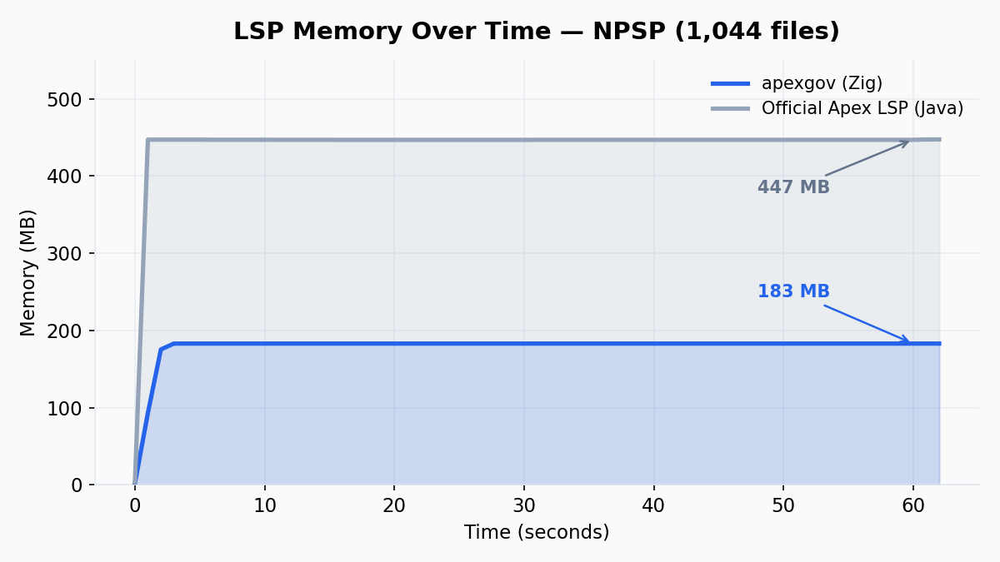
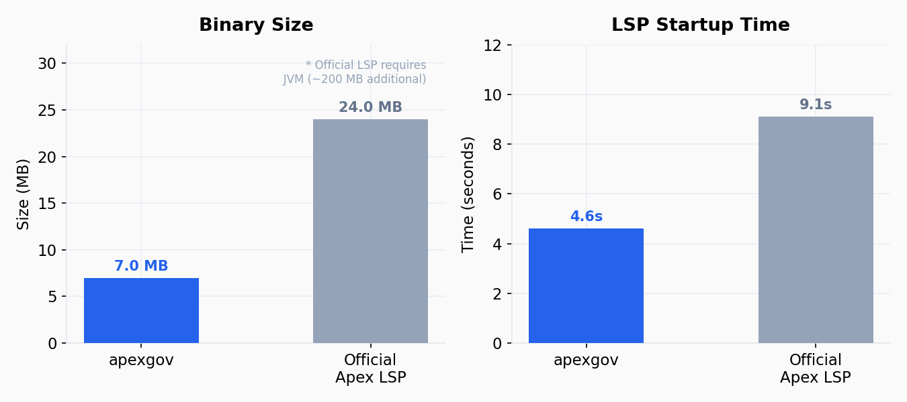

# apexgov

[日本語版 README はこちら](README_ja.md)

`apexgov` is a lightweight LSP, static analyzer, and test runner for Salesforce Apex — built in Zig as a single binary with zero dependencies.

The official Apex Language Server (Java/Jorje) consumes 270 MB+ just to start. apexgov uses **3–4 MB**. Static analysis on 1,044 files completes in **0.69 seconds**. Local test execution runs **1,000x faster** than `sf apex run test`.

## Benchmarks

### LSP Memory Usage



| Repository | Files | apexgov | Official LSP |
|---|---|---|---|
| dreamhouse-lwc | 9 | **3.5 MB** | 288 MB |
| apex-recipes | 139 | **3.9 MB** | 264 MB |
| NebulaLogger | 226 | **3.9 MB** | 289 MB |
| NPSP | 1,044 | **4.3 MB** | 270 MB |

### Memory Over Time (NPSP, 1,044 files)



### Binary Size & Startup Time



| | apexgov | Official Apex LSP |
|---|---|---|
| Binary size | **7.0 MB** (single binary) | 24 MB + JVM |
| Startup time | **4.6s** | 9.1s |

### Static Analysis Speed

| Repository | Files | Time |
|---|---|---|
| dreamhouse-lwc | 9 | **0.01s** |
| apex-recipes | 139 | **0.04s** |
| NebulaLogger | 226 | **0.14s** |
| NPSP | 1,044 | **0.69s** |

### Test Execution (vs sf cli)

| | sf apex run test | apexgov interpret test |
|---|---|---|
| Time | **15.2s** | **0.015s** |
| Result | 8/8 Pass | 8/8 Pass |

Measured on macOS Apple Silicon. LSP benchmarks send JSON-RPC requests via stdio and measure RSS with `ps`. See the [Zenn article](https://zenn.dev/soyukke/articles/apexgov-fast-apex-lsp-and-static-analyzer) for methodology.

## Why

- Detect governor-risk code paths before deploy
- Catch SOQL / DML / SOSL / Callout / Messaging operations inside loops with limit-aware warnings
- Estimate loop upper bounds from guards (`for`/`while`/`do-while`, e.g. `if (n > 200) return`) and flag likely limit-exceed points
- Follow helper-method call chains across files/classes to catch indirect SOQL/DML in loops
- Multiply callee-side loop effects into governor estimates (e.g. nested helper loops)
- Use method arity and inferred literal/new-expression/local-variable types to reduce false positives on overloaded calls
- Resolve interface/inheritance-based dynamic dispatch more accurately (`implements` / `extends`)
- Track CPU/Heap budgets from Apex Debug Logs in CI
- Split multi-transaction debug logs per transaction and compare regressions transaction-by-transaction
- Emit machine-readable reports (`json`, `sarif`) for pipelines

## Static Analysis Rules

| ID | Detection Target |
|---|---|
| AG001 | Nested loops |
| AG002 | SOQL inside loops |
| AG003 | DML inside loops |
| AG004 | JSON serialize/deserialize inside loops |
| AG005 | clone/deepClone inside loops |
| AG006 | Collection allocation inside loops |
| AG007 | String concatenation inside loops |
| AG008 | SOSL inside loops |
| AG009 | Heuristic CPU estimate |
| AG010 | HTTP callout inside loops |
| AG011 | Messaging.sendEmail inside loops |

## LSP (Language Server)

apexgov includes a built-in Apex language server. It provides diagnostics (governor limit violations + parse errors), code completion, go to definition, references, hover, rename, semantic highlighting, and more.

```bash
apexgov lsp   # Starts the LSP server (stdio)
```

Neovim + lazy.nvim quick setup (prebuilt binary, no Zig required):

```lua
{ "soyukke/apexgov", build = function(p)
    local u = vim.uv.os_uname()
    local os = u.sysname == "Darwin" and "darwin" or "linux"
    local arch = u.machine == "arm64" and "aarch64" or "x86_64"
    vim.fn.mkdir(p.dir.."/bin", "p")
    vim.fn.system(("curl -sL https://github.com/soyukke/apexgov/releases/latest/download/apexgov-%s-%s.tar.gz | tar xz -C %s/bin"):format(os, arch, p.dir))
  end, config = function(p)
    vim.filetype.add({ extension = { cls = "apex", trigger = "apex" } })
    vim.lsp.config("apexgov", { cmd = { p.dir.."/bin/apexgov", "lsp" },
      filetypes = { "apex" }, root_markers = { "sfdx-project.json", ".git" } })
    vim.lsp.enable("apexgov")
end }
```

See [docs/lsp-setup.md](docs/lsp-setup.md) for detailed VS Code and Neovim setup instructions.

## Commands

### `interpret test`

Run Apex `@IsTest` methods locally using the Zig-native interpreter. No Salesforce org or JVM required.

```bash
apexgov interpret test force-app/main/default/classes
```

```
[PASS] CalculatorTest#testAdd
[FAIL] CalculatorTest#testAddFail: 2 + 3 should not be 10 | Expected: 10, Actual: 5
[ERROR] CalculatorTest#testDivideByZero: ApexException: Cannot divide by zero

--- Results: 3 total, 1 passed, 2 failed ---
```

The interpreter emulates Salesforce's security model (`PermissionSet`, `ObjectPermissions`, field-level security) and in-memory Database CRUD with SOQL support.

### `check`

Static heuristics for governor / CPU / Heap anti-patterns.

```bash
zig build run -- check force-app --format text
zig build run -- check force-app --format sarif --out reports/apexgov.sarif
```

### `profile`

Offline parser for Apex debug logs with budget checks.

```bash
zig build run -- profile artifacts/logs --config apexgov.toml
zig build run -- profile artifacts/logs --format json --out reports/profile.json
zig build run -- profile artifacts/logs --baseline reports/profile-baseline.json --config apexgov.toml
```

If budget is exceeded, the process exits with code `1`.
When `[ci].fail_on_regression = true`, baseline regressions also exit with code `1`.

### `typegen`

Generate LWC TypeScript type definitions from SFDX metadata. Org connection not required — fully offline.

```bash
zig build run -- typegen my-sfdx-project --out .sfdx/typings/lwc
```

Generated files:

| Module | Source | Output |
|---|---|---|
| `@salesforce/schema/Obj.Field` | `*.field-meta.xml` | `schema.d.ts` |
| `@salesforce/label/c.XXX` | `CustomLabels.labels-meta.xml` | `customlabels.d.ts` |
| `@salesforce/resourceUrl/XXX` | `*.resource-meta.xml` | `{name}.resource.d.ts` |
| `@salesforce/messageChannel/XXX__c` | `*.messageChannel-meta.xml` | `{name}.messageChannel.d.ts` |
| `@salesforce/contentAssetUrl/XXX` | `*.asset-meta.xml` | `{name}.asset.d.ts` |
| `@salesforce/apex/Class.method` | `*.cls` (`@AuraEnabled`) | `apex.d.ts` |

Output for `resource`, `messageChannel`, `asset`, and `customlabels` is byte-identical with the official `@salesforce/lwc-language-server`. Files are processed in alphabetical path order for deterministic output.

## Configuration

Copy `apexgov.toml.example` to `apexgov.toml` and tune budgets.

```toml
[budget.sync]
cpu_ms = 8000
heap_bytes = 5000000

[budget.async]
cpu_ms = 50000
heap_bytes = 10000000

[cpu.model]
base_ms = 500
soql_ms = 35
dml_ms = 25
json_ms = 8
clone_ms = 4

[ci]
fail_on_regression = true
regression_percent = 15
```

## Build and Test

Requires [Zig](https://ziglang.org/) 0.16+. The flake's devShell deliberately does not ship zig/zls — install them separately (e.g. via home-manager with `zig-overlay`) so that `zig` on your PATH resolves to 0.16.

```bash
zig build          # Build (zig-out/bin/apexgov)
zig build test     # Run all unit tests
zig build run -- <subcommand>  # Build & run
```

## Local Validation Fixtures

`examples/apex-validation` contains sample Apex projects and logs for `check` / `profile` validation.
See `examples/apex-validation/README.md` for instructions.

## License

MIT License (`LICENSE`)
